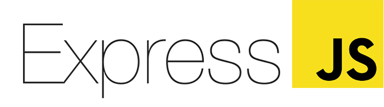

# React Boilerplate (Quick Starter for React, Redux & Saga) #

This React boilerplate is a very basic one which helps you do a quick start in React project while using Redux for state management and Saga for effect management..

### System Requirements ###

* Node version

`v8.12.0`
### Setup ###

* Clone the project and go inside the project folder.

```sh
 git clone https://github.com/Daham/react-boilerplate.git
```
* Go inside the project folder.

```sh
 cd react-boilerplate
```

* Since `webapp` directory is seperately located within the `src`, first change the directory as

```sh
 cd src/web-app
```
* Install dependencies by hitting

```sh
 yarn
```
* To start web application in developer mode

```sh
 yarn start
```
This will start dev server on `http://localhost:3000`

* To build the web application

```sh
 yarn build
```

* To build & deploy the web application

```sh
 yarn deploy
```
### Complementary ###

In this boilerplate, a basic authentication layout and a sophisticated sidebar are readily available.

* In authentication page provide following as credentials to proceed.

```
email: admin
password: admin
```

### Tools & Tech ###

* User Interface Library


* State Management


* Effect Management


* Module Bundler


* Transpiler


* Task Runner


* Web Application is Served by a Minimalistic Express Server


